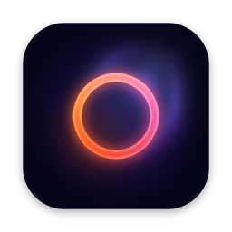
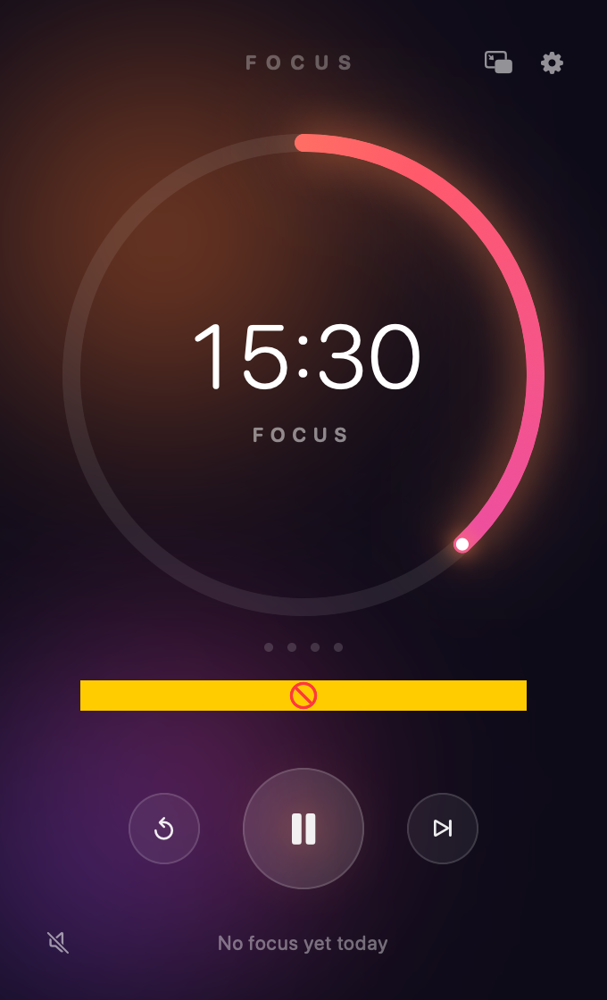
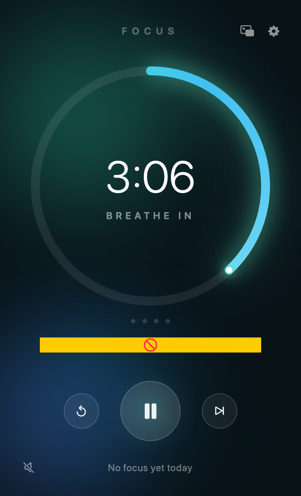
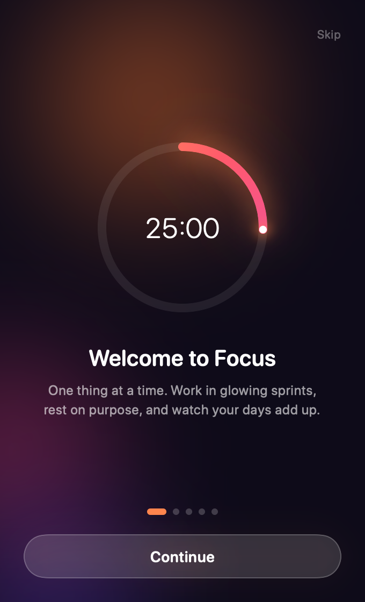
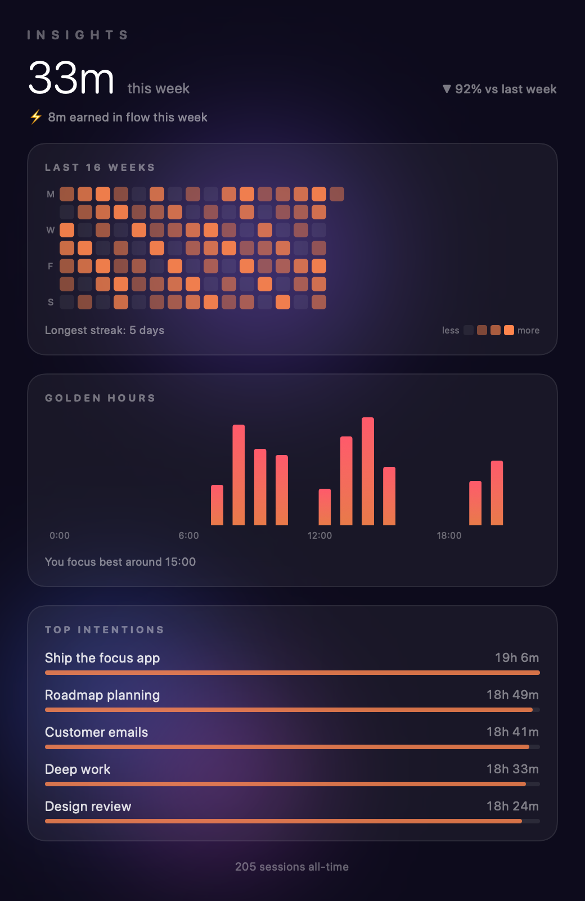
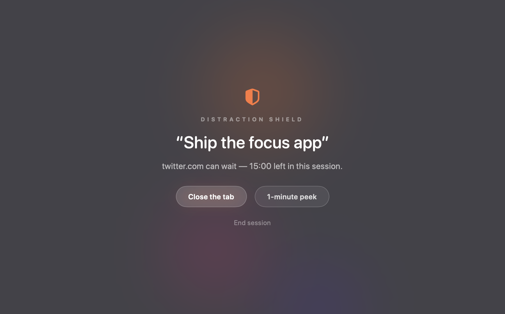

<p align="center">
  
</p>
<h1 align="center">Focus</h1>
<p align="center">A small, beautiful macOS focus companion. One thing at a time.</p>
<p align="center">
  
  
  
</p>

<p align="center">
  
  
  
</p>

## Install

One line, into `/Applications`:

```sh
curl -fsSL https://raw.githubusercontent.com/sakranolog/focus/main/install.sh | bash
```

Or grab `Focus.app.zip` from the [latest release](https://github.com/sakranolog/focus/releases/latest), unzip into `/Applications`, then clear the quarantine flag (the app is ad-hoc signed, not notarized):

```sh
xattr -rd com.apple.quarantine /Applications/Focus.app
```

Or build from source (needs Xcode):

```sh
git clone https://github.com/sakranolog/focus.git && cd focus
./scripts/make_app.sh && open build/Focus.app
```

## What it does

- **Pomodoro engine** — focus / short break / long break, auto-cycling with a long break every 4 sessions (all configurable). Wall-clock anchored, so it survives sleep.
- **Flow mode** — still typing when the timer ends? It keeps rolling ("+3:12 · IN FLOW") instead of yanking you out; the break starts when you go idle, and the extra minutes are logged.
- **Distraction shield** — block whole apps *and* specific websites, covering every connected display. Opening one mid-focus drops a gentle full-screen nudge with your intention on it (Back to focus / 1-minute peek / End session). Site detection reads the active tab in Chrome, Safari, Brave, Edge & Arc via Apple Events; domains match subdomains, and keywords without a dot match anywhere ("n12" blocks n12.co.il). Ships with 8 one-click presets — social media, WhatsApp & chats (app + web), Israeli news, US & world news, streaming, shopping, sports, tech rabbit holes.
- **Shield mode** — flip the 🛡 in the main window or menu bar to guard *without* a session running.
- **Music & soundscapes** — four AI-generated seamless loops (Trance Focus, Deep Techno, Lofi Beats, Ambient Drift), procedurally synthesized Deep Noise / Rainfall / Ocean, or hand playback to **Spotify** (starts your playlist on focus, pauses on breaks). Drop extra tracks into `~/Library/Application Support/Focus/Music` and they appear in the menu.
- **Insights** — weekly total with delta, a 16-week heatmap, "golden hours" histogram, top intentions, streaks, and flow minutes.
- **Menu bar countdown** — glanceable live timer with a rich dropdown control panel (and a ⚙ of its own).
- **Intentions** — type the one thing you're working on; press ↩ to start. It follows you into notifications and the shield.
- **Confirm & log partials** — skipping or resetting mid-session asks first and offers to log the partial focus time.
- **Motivational aura nudges** — every few minutes of focus, a glowing message drifts up from the bottom of your screen ("Deep in it. Stay there.") with the time left. Click-through, context-aware (flow, final stretch, your intention), and toggleable in Settings.
- **Warm chimes & notifications** when phases end; breathing guide during breaks.
- **Onboarding** — a five-step animated walkthrough on first run (replayable from Settings → General).
- **Launch at login & hide Dock icon** — run it as a quiet menu-bar companion.

<p align="center">
  
</p>
<p align="center">
  
</p>

## Controls

- `⌘↩` start / pause · `↩` in the intention field starts the session
- Menu bar icon → quick controls, insights, shield mode, settings, quit
- Quitting mid-session logs your partial focus time automatically
- Session history lives at `~/Library/Application Support/Focus/history.json`

## Development

Plain SwiftUI + SwiftPM — no Xcode project, no dependencies.

```sh
./scripts/make_app.sh                 # build build/Focus.app (UNIVERSAL=1 for arm64+x86_64)
./scripts/make_icon.sh [artwork.png]  # regenerate the .icns
swift scripts/LoopTool.swift in.m4a loop.wav 3 115   # bake a seamless music loop
```

The soundscapes are synthesized live in an `AVAudioSourceNode` (zero assets); the music loops were generated with [Higgsfield](https://higgsfield.ai), trimmed to their sustained region, and equal-power crossfaded tail-into-head so they loop forever without a seam.

Built almost entirely by [Claude Code](https://claude.com/claude-code). MIT licensed.
